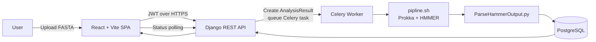
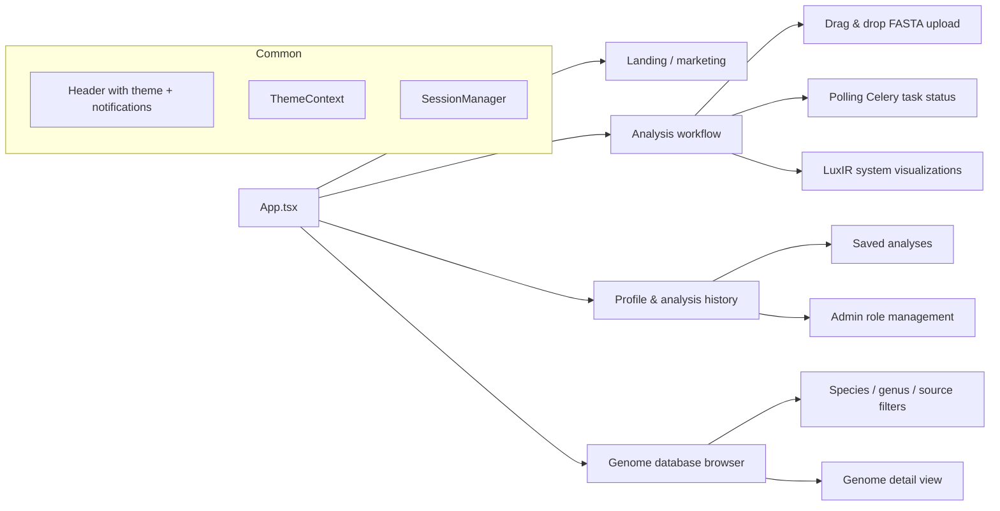

# LUXOME – Bacterial Quorum Sensing Genome Platform

LUXOME is a full‑stack bioinformatics platform for detecting LuxI/LuxR quorum sensing systems in bacterial genomes.
It combines a Django REST API, a React + TypeScript SPA, and a Prokka + HMMER pipeline to turn raw FASTA uploads
into curated, queryable LuxIR system datasets.

> Built to showcase end‑to‑end data engineering, backend architecture, and modern React UX in a real bioinformatics use case.

---

## ✨ Highlights (For Recruiters)

- **Real bioinformatics pipeline**: Prokka + HMMER + custom Python parser to detect LuxI/LuxR quorum sensing systems.
- **Modern full stack**: Django REST API, React 18 + TypeScript + Vite, PostgreSQL, Redis, Celery, Docker.
- **Async & scheduled processing**: Celery workers + beat for heavy genome analyses, NCBI discovery, and cleanup tasks.
- **Secure auth**: Custom User model, JWT (SimpleJWT), email verification, secure cookie storage, session timeout manager.
- **Role‑based data access**: User / admin / superuser roles with genome visibility (public/private) and admin tools.
- **Production‑style DevOps**: Docker Compose stack, health checks, Flower monitoring, environment‑driven configuration.
- **Polished UX**: Tailwind‑styled SPA with enhanced headers, theme toggle, notifications, and profile/analysis dashboards.

---

## 🧬 What LUXOME Does

1. **Upload bacterial genomes** as FASTA files via the web UI.
2. **Asynchronously analyze** each genome through a Prokka + HMMER pipeline running in isolated directories.
3. **Detect LuxI/LuxR quorum sensing systems** using custom HMM profile parsing and domain‑level filtering.
4. **Store results** as temporary analysis activities or permanent `Genome` records in PostgreSQL.
5. **Explore & manage genomes**: filter/search by accession, species, genus, source, and uploader; view LuxIR system counts.

This project demonstrates:

- Designing a domain‑specific analysis pipeline around existing bioinformatics tools.
- Orchestrating long‑running, CPU‑heavy jobs safely in a web product.
- Building a cohesive product experience around a scientific workflow.

---

## 🏗️ Architecture Overview

### High‑Level Flow



### Backend Components

```mermaid
flowchart TB
    subgraph Django Backend
        A[authentication app] --> UModel[Custom User model]
        A --> AuthViews[JWT & email auth endpoints]
        A --> Notif[Notification system]

        B[genomes app] --> GenomeModel[Genome]
        B --> AnalysisResultModel[AnalysisResult]
        B --> Views[REST endpoints]
        B --> Tasks[Celery tasks]

        C[Celery + Redis] --> Worker[Workers]
        C --> Beat[Scheduled jobs]
    end

    Worker --> Pipeline[pipline/ (Prokka + HMMER)]
    Pipeline --> Parser[ParseHammerOutput]
    Parser --> GenomeModel
    Parser --> AnalysisResultModel
```

Key backend pieces:

- `backend/agc_backend/` – Django project config, Celery config, URL routing, Channels ASGI setup.
- `backend/authentication/` – custom `User`, JWT + Allauth integration, permissions, notifications, middleware.
- `backend/genomes/` – `Genome` + `AnalysisResult` models, REST endpoints, Celery tasks, management commands.
- `backend/pipline/` – `pipline.sh` (Prokka + HMMER) and `ParseHammerOutput.py` (LuxIR system parsing).

### Frontend Components



Frontend highlights:

- React 18 + TypeScript, Vite dev server, TailwindCSS styling.
- Enhanced header with logo, theme toggle, notification bell, and flexible actions.
- Auth modal with login/register flows, integrated with JWT + email verification.
- Profile page with editable bio, avatar upload, and analysis history tab.
- Analysis page with drag‑and‑drop uploads, real‑time status updates, and detailed result cards.

---

## 🧪 Bioinformatics Pipeline

- **Input**: User‑uploaded FASTA (`.fna`, `.fasta`, `.fa`, `.fas`).
- **Prokka**: Annotates genes and produces protein FASTA (`.faa`).
- **Prodigal fallback**: Generates proteins if Prokka fails to emit `.faa`.
- **HMMER (hmmscan)**: Scans proteins against `LuxIR.hmm` profiles to detect LuxI/LuxR domains.
- **Custom parser**: `ParseHammerOutput.py` filters by score / E‑value, pairs LuxI & LuxR hits, and identifies:
  - LuxI/LuxR pairs (`LuxIR_System`)
  - Solo LuxI and solo LuxR systems
  - Per‑genome system lists and counts stored in `Genome.luxIR_systems`.

Async behaviour:

- Each analysis runs in **isolated directories** per `ANALYSIS_ID` to avoid race conditions.
- `AnalysisResult` records track status (`PENDING`, `PROCESSING`, `COMPLETED`, `FAILED`).
- Daily cleanup tasks remove stale temporary analyses and files.

---

## 🛠 Tech Stack

- **Backend**: Django, Django REST Framework, Celery, Django Allauth, SimpleJWT
- **Frontend**: React 18, TypeScript, Vite, TailwindCSS, Lucide icons, Framer Motion
- **Data & Messaging**: PostgreSQL, Redis
- **Bioinformatics**: Prokka, HMMER, Prodigal, custom LuxIR parser (pandas‑based)
- **Auth & Security**:
  - Custom User model (email‑based)
  - JWT stored in secure httpOnly cookies
  - Email verification & login throttling
  - Session timeout & activity tracking on the frontend
- **Ops**: Docker, Docker Compose, Flower for Celery monitoring, health checks on services

---

## 🚀 Getting Started

### 1. Run with Docker (recommended)

Prerequisites:

- Docker Desktop running
- At least 4 GB RAM available for containers

From the project root:

```bash
# Start all services (db, redis, backend, celery, frontend, flower)
docker compose up -d

# View status
docker compose ps
```

When everything is healthy:

- Frontend SPA: http://localhost:8001
- Backend API: http://localhost:8000/api/
- Django Admin: http://localhost:8000/admin/
- Celery Flower: http://localhost:5556

Stop the stack:

```bash
docker compose down
# or to also clear DB/Redis data (destructive)
# docker compose down -v
```

### 2. Local Development (without Docker)

Backend:

```bash
cd backend
python -m venv .venv
source .venv/bin/activate  # On macOS/Linux
pip install -r requirements.txt

# Configure Postgres + Redis via .env, then:
python manage.py migrate
python manage.py createsuperuser_with_email
python manage.py runserver  # http://localhost:8000

# In separate terminals
celery -A agc_backend worker --loglevel=info
celery -A agc_backend beat --loglevel=info --scheduler django_celery_beat.schedulers:DatabaseScheduler
```

Frontend:

```bash
cd frontend
npm install
npm run dev   # Vite dev server on http://localhost:8080
```

> The Vite dev server proxies `/api`, `/admin`, `/static`, and `/media` to the Django backend.

### 3. Running Tests

Backend tests:

```bash
cd backend
pytest
# or with coverage
pytest --cov=. --cov-report=html
```

Frontend type check & lint:

```bash
cd frontend
npm run build
npm run lint
```

---

## 📸 Screenshots (placeholders)

> Replace these paths with real screenshots before publishing.

- **Landing / Home**  
  ``

- **Genome Analysis Workflow**  
  ``

- **Genome Database Browser**  
  ``

- **Profile & Analysis History**  
  ``

---

## 🔑 Core User Flows

### Upload & Analyze a Genome

1. Sign up, verify email, and log in.
2. Go to the **Analysis** page.
3. Drag‑and‑drop a FASTA file (client‑side validation checks extension & basic structure).
4. Start analysis – the backend creates an `AnalysisResult` and queues a Celery task.
5. Watch progress in real time; once completed, LuxIR system counts and details appear in the UI.
6. Optionally save the analysis as a permanent `Genome` entry in the database.

### Explore the Genome Database

- Filter genomes by **species**, **genus**, **source** (MANUAL/NCBI/AUTO_NCBI), uploader, and visibility.
- Inspect LuxIR system counts and more detailed JSON‑backed system data.
- Admins can bulk‑queue genomes for reprocessing through the pipeline.

### Manage Profile & Roles

- Update profile (name, title, department, location, profile picture).
- View recent analysis activity and saved analyses.
- Superusers can promote/demote admins via the admin panel tools.

---

## 🎯 Why This Project Matters

- **Depth over demo** – not just a CRUD app: it integrates real scientific tooling, async workloads, and domain logic.
- **Production‑minded** – environment‑driven config, health checks, task monitoring, daily cleanups, and strong
  authentication & session management.
- **User‑centric UX** – thoughtful workflows for scientists: upload → analyze → inspect → save → explore.

If you’d like, I can tailor a short project blurb for your CV or LinkedIn based on this README.
