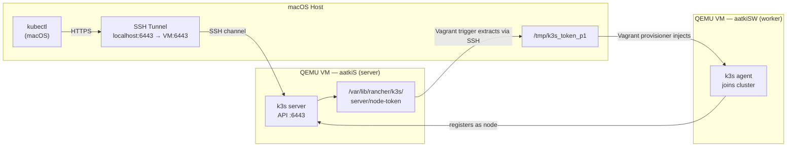
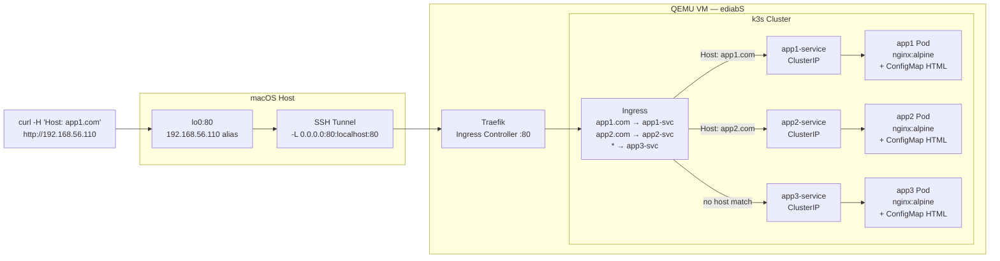
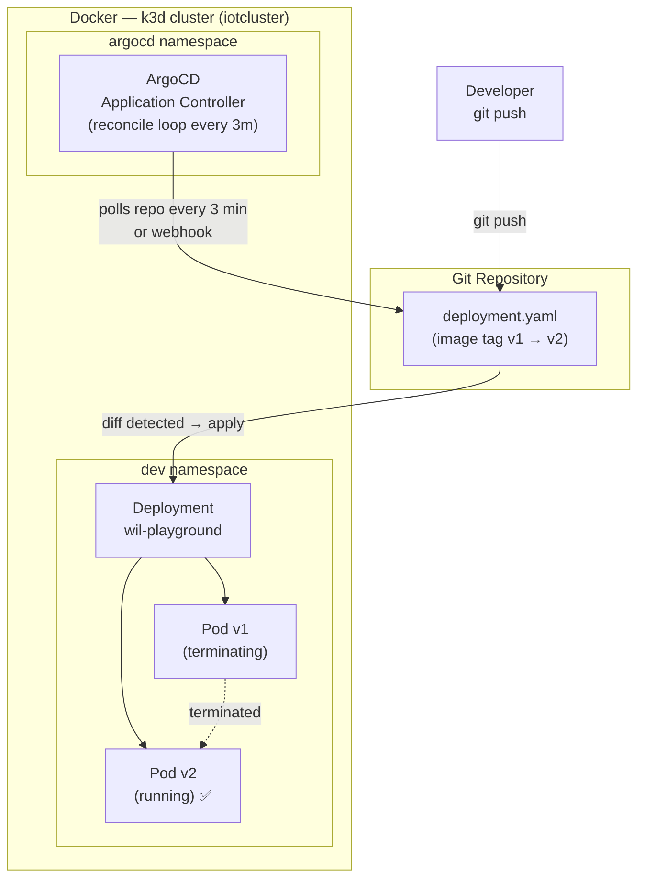
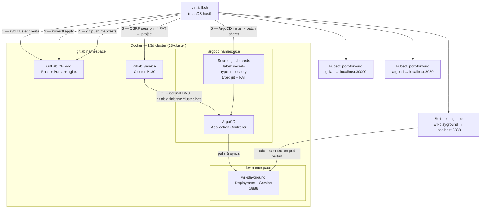

# Inception of Things 🚀

> Built a full GitOps delivery pipeline from absolute zero — no cloud, no magic buttons, just code, containers, and a pathological refusal to click things manually.

---

<!--
  📸 SCREENSHOT — Terminal banner shot:
  Show the bonus install.sh running in a dark terminal (iTerm2 or Warp).
  The frame should capture the 5-step progress banner:
    ┌─────────────────────────────────────────┐
    │   [1/5]  Creating k3d cluster           │
    └─────────────────────────────────────────┘
  ...all the way to the final ╔═══ ALL DONE ═══╗ box with GitLab/ArgoCD/PAT printed.
  Crop tightly — no desktop, no dock. Monochrome green-on-black or your actual theme.
-->


---

## What's going on here?

This project builds a **production-grade DevOps infrastructure on a MacBook** — four progressive parts, each adding a new layer until you end up with a completely automated GitOps loop where pushing a YAML file to Git is the only human action required to deploy an application to Kubernetes.

No AWS. No GCP. No "just click here". Everything runs locally, everything is scripted, everything is reproducible.

---

## Tech Stack

| Layer | Tool | Why |
|---|---|---|
| Virtualisation | QEMU + Apple HVF | ARM64 VMs at near-native speed on M1/M2 |
| VM orchestration | Vagrant | Reproducible environments from a single `Vagrantfile` |
| Kubernetes in-VM | k3s | Full K8s in ~70 MB — Traefik + containerd included |
| Kubernetes in-Docker | k3d | Full cluster as Docker containers — instant spin-up |
| Self-hosted Git | GitLab CE | Because depending on GitHub for a GitOps demo is ironic |
| GitOps controller | ArgoCD | Watches Git, syncs cluster, heals itself — obsessively |
| Ingress / proxy | Traefik | Built into k3s, reads Ingress objects live |
| Container runtime | containerd | The actual thing running containers under the hood |

---

## Part 1 — Two-Node k3s Cluster

**The brief:** two VMs, Vagrantfile only, one server node, one worker node joined to it. `kubectl` from the host machine, no manual SSH, no hardcoded tokens.

**What actually happens under the hood:**

- Vagrant boots two ARM64 QEMU VMs (`aatkiS` server + `aatkiSW` worker)
- The server installs k3s and generates a random **join token** (`/var/lib/rancher/k3s/server/node-token`)
- A Vagrant **trigger** SSHes into the server after boot, extracts the token, writes it to a host temp file
- The worker's provisioner reads that file and runs `k3s agent --server https://... --token ...` — joins the cluster automatically
- Another trigger sets up an SSH **local port-forward** (`host:6443 → VM:6443`) so `kubectl` from macOS hits the real k3s API server inside QEMU

No VirtualBox bridged networking, no static IPs inside the VM — just a single NAT + SSH tunnel doing all the work.

```bash
cd p1 && vagrant up
kubectl get nodes   # runs on macOS, talks to the VM cluster
```

```
NAME      STATUS   ROLES                  AGE
aatkiS    Ready    control-plane,master   2m
aatkiSW   Ready    <none>                 1m
```

<!--
  📊 DIAGRAM — Mermaid flowchart of the p1 architecture:
-->



**Key concepts:** k3s server/agent split, node join tokens, kubeconfig contexts, SSH local port-forwarding, Vagrant multi-machine + triggers, QEMU HVF acceleration, ARM64 Linux VMs.

---

## Part 2 — Ingress Routing: One IP, Three Apps

**The brief:** one VM, one k3s cluster, three apps deployed, all reachable on the same IP via HTTP — routed by the `Host:` header.

**The interesting parts:**

- Every app's HTML lives in a **ConfigMap** mounted as a volume into an nginx container — no custom Docker image, no registry, just Kubernetes config management
- **Traefik** (k3s's built-in Ingress controller) reads Ingress objects from the API server and reconfigures its internal router in real time — no nginx reload, no restart
- QEMU doesn't expose the VM on the LAN — so an SSH tunnel (`-L 0.0.0.0:80:localhost:80`) punches through the NAT, and a **loopback alias** (`ifconfig lo0 alias 192.168.56.110`) makes the VM appear as a real machine on the network

```bash
curl -H "Host: app1.com" http://192.168.56.110   # ✅ App 1 — glassmorphism gradient page
curl -H "Host: app2.com" http://192.168.56.110   # ✅ App 2 — neon green terminal aesthetic
curl http://192.168.56.110                         # ✅ App 3 — default backend, red particles
```

<!--
  📊 DIAGRAM — Mermaid flowchart of p2 request routing:
-->



<!--
  📸 SCREENSHOT — Three curl commands in the terminal side by side (or stacked),
  each returning a different HTML page (you can pipe to `| head -5` to show the
  <title> tag). Alternatively: browser tabs open at the three addresses using a
  browser extension that lets you set custom Host headers (e.g. "ModHeader").
  Show all three apps visually different — the gradient one, the neon green one, the red one.
-->


**Key concepts:** Kubernetes Deployment / Service / ConfigMap / Ingress, virtual host-based routing, Traefik Ingress controller, ConfigMap volume mounts, SSH NAT traversal, loopback interface aliasing.

---

## Part 3 — k3d + ArgoCD: GitOps Enters the Chat

**The brief:** same as p2 but now Kubernetes runs inside Docker (k3d), and ArgoCD watches a Git repo to deploy the app — no `kubectl apply` allowed.

**What makes this non-trivial:**

- k3d wraps a full k3s cluster as Docker containers — `k3d-iotcluster-server-0`, `k3d-iotcluster-agent-0`, a load balancer container. Actual Kubernetes, running in Docker, on your Mac.
- ArgoCD is a GitOps controller: it continuously compares the **desired state** (Git) with the **actual state** (cluster). Any drift → auto-corrected. Any push → auto-deployed. It's basically a control loop that is personally offended by manual changes.
- The ArgoCD `Application` CRD tells it exactly what repo to watch, what path inside the repo to use, and what namespace to deploy to. Change the image tag in `deployment.yaml`, push → ArgoCD detects the diff, rolls out the new version, reports `Synced ✅ Healthy ✅`.

<!--
  📊 DIAGRAM — Mermaid flowchart of p3 GitOps loop:
-->



<!--
  📸 SCREENSHOT — ArgoCD UI in the browser (http://localhost:8080):
  Show the "wil-playground" Application card with:
  - Status: Synced (green checkmark)
  - Health: Healthy (green heart)
  - The resource tree expanded: Application → Deployment → ReplicaSet → Pod
  Dark theme preferred if available.
-->


**Key concepts:** k3d cluster lifecycle, ArgoCD Application CRD, GitOps reconciliation loop, automated sync + self-heal + prune, Kubernetes rolling updates, namespace isolation.

---

## Bonus — One Command to Rule Them All

This is the part where it gets genuinely ridiculous in a good way.

`./install.sh` — a single script — does this:

```
[1/5] Creates a k3d cluster                 (13-cluster)
[2/5] Deploys GitLab CE inside the cluster  (namespace: gitlab)
[3/5] Bootstraps GitLab via its own API:
        → logs in with web session (CSRF + cookie auth)
        → creates a Personal Access Token programmatically
        → creates the inception-ot project via REST API
        → retries until the Rails API is actually warm (not just "booted")
[4/5] Pushes Kubernetes manifests to GitLab
        → bypasses macOS Keychain entirely (GIT_CONFIG_NOSYSTEM=1)
        → re-establishes the port-forward before push (survives long deploys)
[5/5] Deploys ArgoCD + wires it to GitLab:
        → patches the repo secret with correct label + type:git field
        → ArgoCD pulls manifests from self-hosted GitLab
        → deploys wil-playground to dev namespace
        → self-healing port-forward loop for the app (survives pod restarts)
```

**Why this is hard:** GitLab CE takes 3–5 minutes to fully boot its Rails stack. The `/-/health` endpoint returns 200 before the API is ready. The PAT creation needs to go through a web session (CSRF token flow) because the admin password API changed in GitLab 16+. ArgoCD silently rejects repo secrets unless they have a specific label AND a `type: git` field. macOS Keychain intercepts git credentials unless you zero out every config layer. This script handles all of it.

```bash
cd bonus/scripts && ./install.sh
# ~8 minutes later:
# ╔═════════════════════════════════════════╗
# ║          🎉  ALL DONE  🎉               ║
# ║  GitLab  ➜  http://localhost:30090      ║
# ║  ArgoCD  ➜  https://localhost:8080      ║
# ║  App     ➜  http://localhost:8888       ║
# ╚═════════════════════════════════════════╝
```

<!--
  📸 SCREENSHOT — The final ╔══ ALL DONE ══╗ box printed in the terminal.
  Should show the full banner with GitLab URL, ArgoCD URL, PAT token (first 20 chars),
  and App URL. Dark terminal, ideally with a bit of the preceding install steps visible
  above it so context is clear. This is your hero shot for the bonus section.
-->


<!--
  📊 DIAGRAM — Full bonus pipeline from script invocation to live app:
-->



**Key concepts:** k3d, GitLab CE self-hosting, GitLab REST API (CSRF + session auth, PAT creation, project bootstrap), ArgoCD repo secret schema, GitOps end-to-end, macOS Keychain bypass, idempotent bash scripting, self-healing background processes, port-forward lifecycle management.

---

## Skills You're Actually Looking At

| Domain | What was built / solved |
|---|---|
| **Kubernetes** | Pods, Deployments, ReplicaSets, Services, ConfigMaps, Ingress, Namespaces, RBAC secrets, CRDs (ArgoCD Application) |
| **Networking** | SSH local port-forwarding, NAT traversal, virtual host routing, ClusterIP, loopback aliasing, Traefik reverse proxy |
| **GitOps** | Full ArgoCD pipeline: repo wiring, automated sync, self-heal, prune, rolling updates triggered by git push |
| **Infrastructure as Code** | Vagrant multi-machine provisioning, idempotent shell scripts, fully reproducible from zero |
| **Self-hosted tooling** | GitLab CE deployed, configured, and bootstrapped entirely through its own API without any UI interaction |
| **Automation & scripting** | Race condition handling, API readiness probes, retry loops, background process management, macOS-specific quirks |
| **Debugging** | Traced k3d container isolation, GitLab API warmup vs health endpoint gap, ArgoCD secret label requirements, macOS Keychain git interception |

---

## Project Structure

```
.
├── p1/                   # Two-node k3s cluster (Vagrant + QEMU)
│   ├── Vagrantfile
│   └── scripts/
│       ├── server.sh     # Installs k3s server
│       └── worker.sh     # Joins k3s agent
│
├── p2/                   # Ingress routing (Vagrant + k3s + Traefik)
│   ├── Vagrantfile
│   ├── confs/            # app1.yaml  app2.yaml  app3.yaml  ingress.yaml
│   └── scripts/
│       └── setup_server.sh
│
├── p3/                   # k3d + ArgoCD GitOps
│   └── scripts/
│       ├── install.sh
│       └── clean.sh
│
└── bonus/                # Full self-hosted pipeline (one command)
    ├── confs/            # GitLab deployment manifests
    ├── manifests/        # App manifests pushed to GitLab (ArgoCD source)
    └── scripts/
        ├── install.sh    # The orchestrator
        ├── clean.sh      # Keeps GitLab alive, deletes only argocd+dev
        ├── install_k3d.sh
        ├── install-gitlap.sh
        └── install_bonus.sh
```

---

## Running It

> **Requirements:** macOS Apple Silicon, Docker Desktop running, Homebrew installed. Everything else is handled.

```bash
# Part 1
cd p1 && vagrant up

# Part 2
cd p2 && vagrant up
curl -H "Host: app1.com" http://192.168.56.110

# Part 3
cd p3/scripts && ./install.sh

# Bonus — the full thing
cd bonus/scripts && ./install.sh
```

Cleanup (non-destructive — keeps GitLab alive for fast re-runs):
```bash
bonus/scripts/clean.sh    # deletes argocd + dev namespaces only
bonus/scripts/clean.sh && bonus/scripts/install.sh  # full re-run in ~2 min
```
