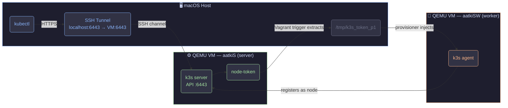
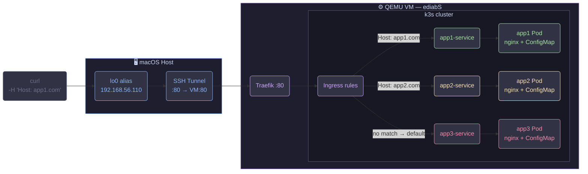
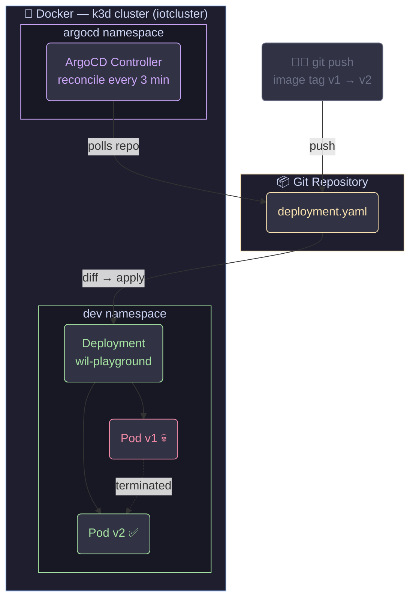
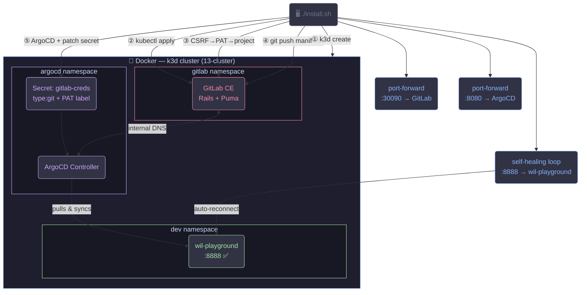

# Inception of Things 🚀

> Built a full GitOps delivery pipeline from absolute zero — no cloud, no magic buttons, just code, containers, and a pathological refusal to click things manually.

---

<!--
  📸 SCREENSHOT — Terminal hero shot:
  Capture the bonus install.sh finishing inside a dark terminal (iTerm2 / Warp).
  Show the final ╔═══ ALL DONE ═══╗ ASCII box with GitLab URL, ArgoCD URL, PAT and App URL visible.
  Keep a few lines of the install steps above it for context. Tight crop, no desktop or dock.
  Green-on-black or your actual color scheme — just make it look sharp.
-->


---

## What's going on here?

Production-grade DevOps infrastructure, built entirely on a MacBook — four progressive parts, each adding a new layer until a single `./install.sh` spins up a fully automated GitOps loop. Pushing a YAML file to Git is the only human action needed to deploy to Kubernetes.

No AWS. No GCP. No clicking. Everything is code, everything is reproducible.

---

## Tech Stack

| Layer | Tool | Why |
|---|---|---|
| Virtualisation | QEMU + Apple HVF | ARM64 VMs at near-native speed on M1/M2 |
| VM orchestration | Vagrant | Reproducible environments from a single `Vagrantfile` |
| Kubernetes in-VM | k3s | Full K8s in ~70 MB — Traefik + containerd included |
| Kubernetes in-Docker | k3d | Full cluster as Docker containers — instant spin-up |
| Self-hosted Git | GitLab CE | Because depending on GitHub for a GitOps demo is ironic |
| GitOps controller | ArgoCD | Watches Git, syncs cluster, heals itself — obsessively |
| Ingress / proxy | Traefik | Built into k3s, reads Ingress objects live |
| Container runtime | containerd | The actual thing running containers under the hood |

---

## Skills You're Actually Looking At

> The concepts that matter for real DevOps/Platform/SRE roles — earned by hitting every sharp edge of each tool.

<table>
<tr>
<td>

**☸️ Kubernetes**
Pods · Deployments · ReplicaSets · Services
ConfigMaps · Ingress · Namespaces
RBAC Secrets · ArgoCD Application CRD

</td>
<td>

**🌐 Networking**
SSH local port-forwarding · NAT traversal
Virtual host routing · ClusterIP
Loopback aliasing · Traefik reverse proxy

</td>
</tr>
<tr>
<td>

**🔄 GitOps**
Full ArgoCD pipeline: repo wiring
Automated sync · self-heal · prune
Rolling updates triggered by `git push`

</td>
<td>

**⚙️ Infrastructure as Code**
Vagrant multi-machine provisioning
Idempotent shell scripts
Fully reproducible environment from zero

</td>
</tr>
<tr>
<td>

**🏗️ Self-hosted Tooling**
GitLab CE: deployed, bootstrapped and
configured entirely via its own REST API
— zero UI interaction

</td>
<td>

**🐛 Real Debugging**
k3d container isolation · GitLab Rails warmup gap
ArgoCD secret label schema · macOS Keychain
git interception · CSRF session auth flows

</td>
</tr>
</table>

---

## The Parts

### Part 1 — Two-Node k3s Cluster

Two QEMU ARM64 VMs provisioned from a single `Vagrantfile`. The server installs k3s and generates a join token; a Vagrant trigger SSHes in, extracts it, and injects it into the worker automatically. An SSH port-forward (`host:6443 → VM:6443`) makes `kubectl` work from macOS without any static networking.

```bash
cd p1 && vagrant up
kubectl get nodes
# aatkiS    Ready    control-plane   2m
# aatkiSW   Ready    <none>          1m
```



**Concepts:** k3s server/agent architecture · node join tokens · kubeconfig · SSH port-forwarding · Vagrant triggers · QEMU HVF

---

### Part 2 — Ingress Routing: One IP, Three Apps

One VM, one k3s cluster, three apps, one IP. Each app's HTML lives in a **ConfigMap** mounted into nginx — no custom images. Traefik reads the `Host:` header live and routes accordingly. QEMU NAT is bypassed via an SSH tunnel + loopback alias.

```bash
curl -H "Host: app1.com" http://192.168.56.110   # ✅ glassmorphism gradient
curl -H "Host: app2.com" http://192.168.56.110   # ✅ neon green terminal
curl http://192.168.56.110                         # ✅ default backend
```

<!--
  📸 SCREENSHOT — Three browser tabs (or three curl outputs in split panes) showing
  each app looking visually distinct: the purple gradient one, the neon green matrix one,
  and the dark red particles one. Use a browser extension like "ModHeader" to set the
  Host header in the browser for a cleaner visual. All pointing at 192.168.56.110.
-->




**Concepts:** Deployment · Service · ConfigMap volume mounts · Ingress host routing · Traefik · SSH NAT traversal · loopback aliasing

---

### Part 3 — k3d + ArgoCD: GitOps Enters the Chat

Kubernetes inside Docker, controlled by Git. k3d spins up a full cluster as containers. ArgoCD watches a repo and is personally offended by any drift between Git and the cluster — it corrects it immediately, automatically, without asking.

Change the image tag in `deployment.yaml`, push → ArgoCD detects the diff → rolls out the new version → `Synced ✅ Healthy ✅`. Zero `kubectl apply`.

<!--
  📸 SCREENSHOT — ArgoCD UI at http://localhost:8080 (dark theme).
  Show the wil-playground Application card with Synced ✅ Healthy ✅ status.
  Expand the resource tree: Application → Deployment → ReplicaSet → Pod.
  Ideally capture it mid-sync (yellow "Syncing" → green) for drama.
-->




**Concepts:** k3d lifecycle · ArgoCD Application CRD · GitOps reconciliation · automated sync + self-heal + prune · rolling updates · namespace isolation

---

### Bonus — One Command to Rule Them All

The entire infrastructure — cluster, self-hosted Git server, GitOps controller, deployed app — from a single script.

```bash
cd bonus/scripts && ./install.sh
```

```
[1/5] k3d cluster
[2/5] GitLab CE deployed (self-hosted, inside the cluster)
[3/5] GitLab bootstrapped: CSRF login → PAT → project via REST API
[4/5] Manifests pushed to GitLab (macOS Keychain bypassed)
[5/5] ArgoCD deployed + wired to GitLab → app live at :8888
```

The non-obvious problems this solves: GitLab's `/-/health` returns 200 before the Rails API actually works (retry loop). PAT creation requires a full web session CSRF flow (GitLab 16+ removed the simple API). ArgoCD silently ignores repo secrets without a specific label + `type: git` field. macOS Keychain hijacks git credentials unless you zero out every config layer. Port-forwards die after the script exits unless you `disown` them.

<!--
  📸 SCREENSHOT — The ╔══ ALL DONE ══╗ terminal banner from the end of install.sh.
  Show all 5 URLs + PAT printed inside the box. Keep 10–15 lines of install output
  above it visible. Dark terminal. This is the money shot.
-->




**Concepts:** k3d · GitLab CE self-hosting · GitLab REST API (CSRF + session auth) · ArgoCD repo secrets · GitOps E2E · macOS Keychain bypass · idempotent scripting · self-healing port-forwards

---

## Project Structure

```
.
├── p1/                   # Two-node k3s cluster (Vagrant + QEMU)
│   ├── Vagrantfile
│   └── scripts/          server.sh · worker.sh
│
├── p2/                   # Ingress routing (Vagrant + k3s + Traefik)
│   ├── Vagrantfile
│   ├── confs/            app1.yaml · app2.yaml · app3.yaml · ingress.yaml
│   └── scripts/          setup_server.sh
│
├── p3/                   # k3d + ArgoCD GitOps
│   └── scripts/          install.sh · clean.sh
│
└── bonus/                # Full self-hosted pipeline (one command)
    ├── confs/            GitLab deployment manifests
    ├── manifests/        App manifests → pushed to GitLab → synced by ArgoCD
    └── scripts/          install.sh · clean.sh · install_k3d.sh · install-gitlap.sh · install_bonus.sh
```

---

## Running It

> **Requirements:** macOS Apple Silicon · Docker Desktop · Homebrew. The bonus script handles everything else.

```bash
cd p1             && vagrant up                            # Part 1
cd p2             && vagrant up                            # Part 2
cd p3/scripts     && ./install.sh                         # Part 3
cd bonus/scripts  && ./install.sh                         # Bonus — full pipeline
```

```bash
# Cleanup — non-destructive (keeps GitLab alive for fast re-runs)
bonus/scripts/clean.sh
# Full re-run in ~2 min instead of ~8 min
bonus/scripts/clean.sh && bonus/scripts/install.sh
```
